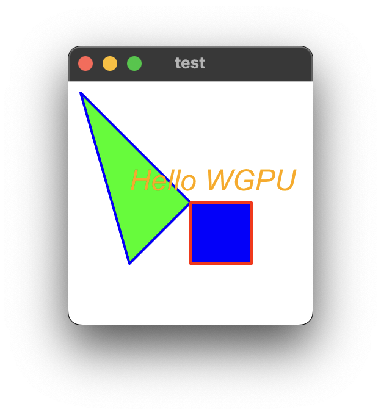

# wgpu-canvas
**wgpu-canvas** is a browser-less implementation of the HTML Canvas drawing API for Node.js using Rust Neon.

This project was inspired by the skia-canvas project (https://github.com/samizdatco/skia-canvas) and changed the backend from **skia** to **wgpu**. Many parts of the canvas API were borrowed from the skia-canvas project, and wgpu used vello 2D graphics (https://github.com/linebender/vello).

The DOM API was rewritten in ES6 based on the code from https://github.com/fgnass/domino, and the CSS was modified from https://github.com/NV/CSSOM based on ES6.

The html parser is https://github.com/inikulin/parse5 and the svg code was borrowed from https://github.com/svgdotjs/svgdom.

This project was bootstrapped by [create-neon](https://www.npmjs.com/package/create-neon).


## Installing wgpu-canvas
Installing wgpu-canvas requires a [supported version of Node and Rust](https://github.com/neon-bindings/neon#platform-support).

You can install the project with npm. In the project directory, run:

```sh
$ git clone https://github.com/kyeongwoon/wgpu-canvas
$ cd wgpu-canvas
$ npm install
```

This fully installs the project, including installing any dependencies and running the build.

## Building wgpu-canvas

If you have already installed the project and only want to run the build, run:

```sh
$ npm run build
```

This command uses the [cargo-cp-artifact](https://github.com/neon-bindings/cargo-cp-artifact) utility to run the Rust build and copy the built library into `./wgpu_canvas.node`.

## Usage
```js
'use strict'
import { App, Window,} from './lib/index.js'

const app = new App();
app.run();

const win = Window.open(null, 'test', 'resizable,width=300,height=300');
function draw(win) {
    const ctx = win.canvas.getContext("2d")

    // ...
}

win.requestAnimationFrame(draw);

```


## to do
- support SVG rendering
- support CSS Box layout